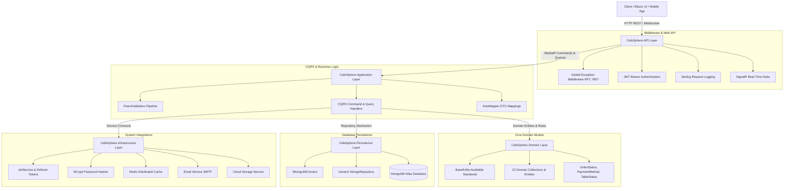
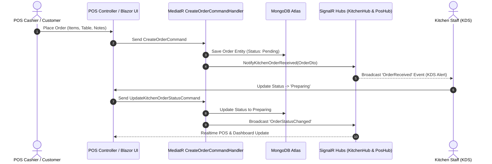

# CafeSphere - Enterprise Backend API


**CafeSphere** is a production-ready, enterprise-grade SaaS Cafe & Restaurant Management Platform backend. Built with Microsoft Senior Architecture standards using **ASP.NET Core 9 Web API**, **Clean Architecture**, **CQRS pattern**, **MongoDB Atlas**, **JWT Dual-Token Security**, **SignalR Real-time Hubs**, **Serilog**, and **Docker**.

---

## 🏗️ Architecture & Workflow Diagram

### Clean Architecture & Request Pipeline Flow



---

## 🔄 Real-Time Kitchen Display System (KDS) & POS Workflow



---

## ⚡ Tech Stack Breakdown

- **Framework**: ASP.NET Core 9 Web API (.NET 9 / C# 13)
- **Architecture**: Clean Architecture (Domain, Shared, Application, Persistence, Infrastructure, API, Tests)
- **Patterns**: CQRS (MediatR), Repository Pattern, Options Pattern, Result Pattern (`Result<T>`), Pipeline Behaviors
- **Database Engine**: MongoDB Atlas via official `MongoDB.Driver`
- **Security**: Dual-Token JWT (Short-lived Access Tokens + HttpOnly Refresh Tokens), BCrypt Hashing, Role-Based & Policy Authorization
- **Real-Time Communication**: SignalR WebSockets (`KitchenHub`, `PosHub`, `DashboardHub`, `NotificationHub`)
- **Logging**: Serilog (Console & Rolling File Sinks)
- **Validation**: FluentValidation
- **Object Mapping**: AutoMapper
- **Documentation**: Swagger / OpenAPI 3.0 with JWT Bearer Security Scheme
- **Caching**: Redis Distributed Cache (`StackExchange.Redis`) & In-Memory Fallback
- **DevOps**: Multi-stage `Dockerfile`, `docker-compose.yml`, and GitHub Actions CI/CD Pipeline

---

## 📁 Solution Structure

```text
CafeSphere.sln
├── src/
│   ├── CafeSphere.Domain/           # Core Entities, Enums, BaseEntity, Domain Events, IMongoRepository
│   ├── CafeSphere.Shared/           # Result<T>, PagedResult<T>, AppException, System Roles & Permissions
│   ├── CafeSphere.Application/      # CQRS Handlers, DTOs, FluentValidation, AutoMapper Profiles, Interfaces
│   ├── CafeSphere.Persistence/      # MongoDbContext, MongoRepository<T>, Index Initialization & Seeding
│   ├── CafeSphere.Infrastructure/   # JwtService, PasswordHasher, EmailService, Storage, Redis Cache
│   └── CafeSphere.API/              # RESTful Controllers, Middlewares, SignalR Hubs, Serilog, Program.cs
└── tests/
    └── CafeSphere.Tests/            # xUnit Unit tests for Domain models, CQRS handlers, and validation rules
```

---

## 🔐 Environment Variables (`.env`)

Configure your environment variables in `.env` at the solution root:

```env
PORT=5000
ASPNETCORE_ENVIRONMENT=Development
ASPNETCORE_URLS=http://+:5000

# MongoDb Atlas Configuration
MongoDbSettings__ConnectionString=mongodb://localhost:27017
MongoDbSettings__DatabaseName=CafeSphereDb
MongoDbSettings__AutoCreateIndexes=true

# Security & JWT Authentication
JwtSettings__Secret=CafeSphere_Production_Super_Secret_JWT_Signing_Key_2026_Enterprise!
JwtSettings__Issuer=CafeSphereAPI
JwtSettings__Audience=CafeSphereApp
JwtSettings__ExpiryMinutes=60
JwtSettings__RefreshTokenExpiryDays=7

# CORS Allowed Origins
CORS_ALLOWED_ORIGINS=http://localhost:5288,http://localhost:5000
```

---

## 🚀 Quick Start Guide

### Option 1: Run via .NET CLI

1. **Clone the Repository**:
   ```bash
   git clone https://github.com/shammichalas/cafesphere-API.git
   cd cafesphere-API
   ```

2. **Restore & Build**:
   ```bash
   dotnet restore CafeSphere.sln
   dotnet build CafeSphere.sln -c Release
   ```

3. **Run the API**:
   ```bash
   dotnet run --project src/CafeSphere.API/CafeSphere.API.csproj
   ```

4. **Access Swagger Documentation**:
   Navigate to `http://localhost:5000/swagger` in your browser.

---

### Option 2: Run via Docker Compose

```bash
docker-compose up --build -d
```

This spins up the complete local stack:
- **API**: `http://localhost:5000`
- **MongoDB**: `localhost:27017`
- **Redis**: `localhost:6379`

---

## 🧪 Running Unit Tests

Execute the xUnit test suite covering Domain entities and CQRS handlers:

```bash
dotnet test CafeSphere.sln
```

---

## 🌐 Key API Endpoints Reference

| Module | Method | Endpoint | Description |
| :--- | :--- | :--- | :--- |
| **Auth** | `POST` | `/api/v1/auth/register` | Register customer or staff user |
| **Auth** | `POST` | `/api/v1/auth/login` | Authenticate user & return JWT tokens |
| **Orders** | `GET` | `/api/v1/orders` | Fetch paginated order queue |
| **Orders** | `POST` | `/api/v1/orders` | Create new order (POS/Dine-In/Takeaway) |
| **POS** | `POST` | `/api/v1/pos/checkout` | Process checkout payment & generate receipt |
| **Kitchen**| `GET` | `/api/v1/kitchen/queue` | Retrieve active KDS preparation tickets |
| **Kitchen**| `PATCH`| `/api/v1/kitchen/orders/{id}/status` | Update kitchen preparation status |
| **Dashboard**| `GET` | `/api/v1/dashboard/metrics` | Retrieve real-time sales KPIs & top products |
| **Catalog**| `GET` | `/api/v1/products` | Retrieve catalog products |
| **AI** | `POST` | `/api/v1/ai/recommendations` | Get AI sales predictions & stock insights |

---

## 📄 License

This project is licensed under the MIT License - see the [LICENSE](LICENSE) file for details.
