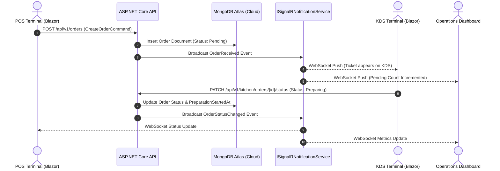

# CafeSphere API — Real-Time Enterprise Cafe Management Platform

CafeSphere is an asynchronous, event-driven web application built with **.NET 10 Web API**, **Clean Architecture**, **CQRS (MediatR)**, **MongoDB Atlas Persistence**, **SignalR WebSockets**, and a **Blazor WebAssembly** frontend.

---

## 🏛️ System Architecture

The platform strictly follows Clean Architecture principles with clear separation of concerns across 4 solution layers:

```
                  ┌─────────────────────────────────────────┐
                  │          CafeSphere.API (Web)           │
                  │   REST Endpoints, SignalR WebSockets    │
                  └────────────────────┬────────────────────┘
                                       │
                                       ▼
                  ┌─────────────────────────────────────────┐
                  │         CafeSphere.Application          │
                  │   CQRS Handlers, Validation, Interfaces  │
                  └────────────────────┬────────────────────┘
                                       │
                    ┌──────────────────┴──────────────────┐
                    ▼                                     ▼
┌──────────────────────────────────────┐ ┌──────────────────────────────────────┐
│       CafeSphere.Infrastructure      │ │        CafeSphere.Persistence        │
│   JWT Auth, BCrypt, Security, Email  │ │   MongoDB Driver, Repositories, Seed │
└──────────────────────────────────────┘ └──────────────────────────────────────┘
                    │                                     │
                    └──────────────────┬──────────────────┘
                                       ▼
                  ┌─────────────────────────────────────────┐
                  │           CafeSphere.Domain             │
                  │   Domain Entities, Enums, Contracts    │
                  └─────────────────────────────────────────┘
```

---

## 🔄 Live Real-Time Event Loop (SignalR WebSockets)



---

## 📊 Implementation Status Matrix

| Module | Persistence | Real-Time Loop | Description |
| :--- | :---: | :---: | :--- |
| **Authentication & JWT** | ✅ MongoDB Atlas | ➖ | User registration, BCrypt password hashing, JWT Access & Refresh Token rotation. |
| **Point of Sale (POS)** | ✅ MongoDB Atlas | ✅ SignalR WebSockets | Menu browsing, line item total computation, 8% tax calculation, checkout payments, and ticket generation. |
| **Kitchen Display (KDS)** | ✅ MongoDB Atlas | ✅ SignalR WebSockets | Active ticket queue, status state machine transitions (`Pending` ➔ `Preparing` ➔ `Ready` ➔ `Completed`), preparation time tracking. |
| **Operations Dashboard** | ✅ MongoDB Atlas | ✅ SignalR WebSockets | MongoDB aggregation pipeline calculating today's revenue, order counts, active tickets, and top-selling products by quantity. |
| **Product & Categories** | ✅ MongoDB Atlas | ➖ | Catalog hierarchy, slug indexing, and availability management. |
| **Inventory Management** | ✅ MongoDB Atlas | ➖ | Raw ingredient stock tracking, unit cost, and reorder threshold alerts. |
| **AI Sales Assistant** | ✅ MongoDB Atlas | ➖ | Context-aware sales analytics and inventory restock recommendation handler. |
| **Reservations & Staff** | ✅ MongoDB Atlas | ✅ SignalR WebSockets | Interactive seating allocation, live booking slots, guest seating state triggers, and ReservationsHub synchronization. |


---

## ⚡ Quick Start & Run Locally

### 1. Run Backend API
```bash
cd backend
dotnet restore CafeSphere.sln
dotnet run --project src/CafeSphere.API/CafeSphere.API.csproj
```
*Swagger OpenAPI Documentation available at `http://localhost:5000/swagger`.*

### 2. Run Blazor WebAssembly UI
```bash
cd UI
dotnet run
```
*Access UI in browser at `http://localhost:5165`.*

### 3. Run Automated Unit Tests
```bash
cd backend
dotnet test CafeSphere.sln
```
